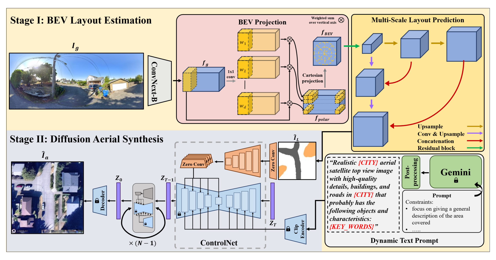
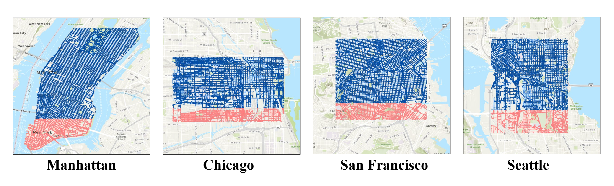

# GPG2A (Geometric Preserving Ground-to-Aerial image synthesis)
Official code repository for the paper "[Cross-View Meets Diffusion: Aerial Image Synthesis with Geometry and Text Guidance](https://arxiv.org/abs/2408.04224)" presented at WACV, 2025.




## Prerequisites
### Training & Testing
- accelerate
- diffusers
- Pytorch >= 2.1.2
- torchvision >= 0.16.2
- pillow
- tqdm
### Evaluation (Additionaly)
- scikit-image
- opencv
- lpips

## Dataset
Please fill out the form provided [here](https://forms.gle/6YeGYBA9DRnkipVk6) to download VIGORv2



## Pre-trained Weights
Our checkpoints can be downloaded from the [following link](https://drive.google.com/file/d/1dvpZ3PfDs-b2EaSw1wsUdtrmP5m-7Hwf/view?usp=sharing)

## Training
After downloading VIGORv2 and the pre-trained weights, for the best experience, make sure your repository tree is as follows:
```bash
GPG2A
├── checkpoints
│   ├── Stage_I/
│   └── Stage_II/
├── data
│   └── VIGORv2/
├── Stage_I/
├── Stage_II/
└── utils.py
```

### Stage I (BEV Layout Estimation)
To train stage I (BEV Layout Estimation) navigate to the root directory and run the following script
```
bash ./Stage_I/train.sh
```
Note that you can customize the training experiment using the arguments provided in `./Stage_I/train.py` by simply passing them to `./Stage_I/train.sh`

This script will save checkpoints at every epoch in `./OUTPUT_DIR/checkpoints`

### Stage II (Diffusion Aerial Synthesis)
To train stage II (Diffusion Aerial Synthesis) navigate to the root directory and run the following script
```
bash ./Stage_II/train.sh
```
Note that you need to have the checkpoints of stage I saved in the correct location (as shown in the above tree).

You can customize the training experiment using the arguments provided in `./Stage_II/train.py` by simply passing them to `./Stage_II/train.sh`, for example:
```
--text_type="dynamic"
--VIGOR_mode="samearea"
```
The following are the main experiments ran in the paper:
| Argument       | Experiment    |
|----------------|---------------|
| `--text_type="dynamic"` | Dynamic text prompt extracted from Gemini discriptions of the ground image |
| `--text_type="raw"` | Gemini descriptions of the ground image without processing |
| `--text_type="constant"` | A constant single generic prompt, e.g., "High-quality aerial image" |
| `--text_type="city"` | Same as 'constant' prompt but with city name |
| `--text_type="empty"` | Empty string |
| `--VIGOR_mode="samearea"` | Same-area training protocol |
| `--VIGOR_mode="crossarea"` | Cross-area training protocol|
| `--f_bev` | Use the raw BEV feature instead of the estimated layout map |

## Testing
### Stage I (BEV Layout Estimation)
To test stage I (BEV Layout Estimation) navigate to the root directory and run the following script
```
bash ./Stage_I/test.sh
```
Note that you need to have the checkpoints of stage I saved in the correct location (as shown in the above tree).

### Stage II (Diffusion Aerial Synthesis)
To test stage II (Diffusion Aerial Synthesis) navigate to the root directory and run the following script
```
bash ./Stage_II/test.sh
```
Note that you need to have the checkpoints of stages I and II saved in the correct location (as shown in the above tree).

This script saves all generated images of the test set in the specified output directory (`./log_imgs_test` by default)

## Evaluations
This section covers evaluating the generated images from GPG2A, so it assumes already having a directory of generated images (from the test set). 

All evaluation scripts are in `./Evaluation/`

### Pre-trained SAFA model
Please download the pretrained SAFA model [here](https://drive.google.com/file/d/1z6BB_CUQxDyN4y7LUbxhJcoh75f9MW5N/view?usp=sharing) and extract to the same directory.

### Generate aerial images
Please follow the training and testing tutorial above to generate aerial images for evaluation with correct naming and directory.

### $Sim_c$ and $Sim_s$
To calculate $Sim_c$ and $Sim_s$, please run the command below,

```bash
python eval_SAFA.py --model_path SAFA_PRETREAINED_MODEL_PATH --experiment_name YOUR_PREFERRED_EXPERIMENT_NAME --image_path GENERATED_IMAGE_PATH --gt_path GROUND_TRUTH_IMAGE_PATH
```

For example,
```bash
python eval_SAFA.py --model_path ../GPG2A_eval_SAFA_model/ --experiment_name GPG2A_experiment --image_path ../log_imgs_test/ --gt_path ../Data/VIGOR/
```

### FID-SAFA
To calculate FID-SAFA, please run the command below,

```bash
python eval_FID.py --model_path SAFA_PRETREAINED_MODEL_PATH --experiment_name YOUR_PREFERRED_EXPERIMENT_NAME --image_path GENERATED_IMAGE_PATH --gt_path GROUND_TRUTH_IMAGE_PATH
```

For example,
```
python eval_FID.py --model_path ../GPG2A_eval_SAFA_model/ --experiment_name GPG2A_experiment --image_path ../log_imgs_test/ --gt_path ../Data/VIGOR/
```

### LPIPS, SSIM, PSNR
To calculate LPIPS, SSIM, PSNR, please run the command below,
```
python test_lpips.py --experiment_name YOUR_PREFERRED_EXPERIMENT_NAME --image_path GENERATED_IMAGE_PATH --gt_path GROUND_TRUTH_IMAGE_PATH
```

For example,

```
python test_lpips.py --experiment_name GPG2A_experiment --image_path ../log_imgs_test/ --gt_path ../Data/VIGOR/
```


